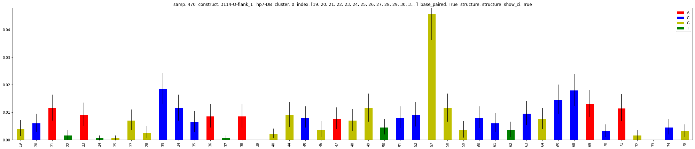

=========
Examples
=========

Load data
=========

.. note::

    This example is well-explained on part :ref:`loading_data`.

.. list-table:: studies.csv
   :widths: 25 75 25 25 50
   :header-rows: 1

   * - name
     - description
     - samples
     - conditions
     - label
   * - salt
     - Change the Na concentration
     - A6
     - 0.15
     - Na quantity [M]
   * - salt
     - Change the Na concentration
     - B6
     - 0.3
     - Na quantity [M]
   * - salt
     - Change the Na concentration
     - C6
     - 0.6
     - Na quantity [M]
   * - salt
     - Change the Na concentration
     - D6
     - 1
     - Na quantity [M]
   * - salt
     - Change the Na concentration
     - E6
     - 1.2
     - Na quantity [M]

.. code-block:: yaml
    :caption: config.yml

    path_to_data: /Users/ymdt/src/data/Gabe
    path_to_studies: /Users/ymdt/src/data/Gabe/studies.csv
    min_cov_bases: 1000
    filter_by: study
    index: all
    base_type: ['A', 'C']
    base_paired: True
    structure: structure_DMS

.. code-block:: python
    :caption: Example code

    from dreem_nap.study import Study

    with open('config.yml', 'r') as ymlfile:
        cfg = yaml.safe_load(ymlfile)

    salt = Study.load_studies(cfg['path_to_studies'])['salt']

    salt.load_df_from_local_files(path_to_data= '/path/to/data/',
                                  min_cov_bases= cfg['min_cov_bases'],
                                  filter_by = cfg['filter_by'],
                                  index = cfg['index'],
                                  base_type = cfg['base_type'],
                                  base_paired = cfg['base_paired'],
                                  structure = cfg['structure'])
    # Show the dataframe
    salt.get_df().head()

Plot data
=========

A single plot
*************

.. code-block:: python

    salt.plot.mut_histogram(samp='B6',
                            construct='3114',
                            cluster=0,
                            index=list(range(19,80)),
                            base_paired=True,
                            structure='structure')

Multiple plots
**************

.. code-block:: python

    from dreem_nap import util
    sub_lib = 'MS2' # say that you only want to plot this sub-library
    mpl.use('agg')  # use this to avoid display issues
    df = salt.get_df()
    for samp in salt.samples:
        for construct in salt.constructs:
            for cluster in df[(df['samp']==samp)&(df['construct']==construct)]['cluster'].unique():
                if df[(df['samp']==samp)&(df['construct']==construct)&(df['cluster']==cluster)]['sub-library'].iloc[0] == sub_lib:
                    salt.plot.mut_histogram(samp=samp,construct=construct, cluster=cluster)
                    # save the figure and closes it
                    util.save_fig(path_to_figs+'/'+salt.name+'/'+samp+'_'+construct+'_mut_histogram.png') 
            

Download data
=============

A sub-dataframe of a single sample-construct-cluster
*****************************************************

.. code-block:: python

    df = salt.mani.get_SCC(samp='C6',
                           construct='9572', 
                           cols=['mut_rates','sequence','structure','cov_bases'],
                           base_type=['A','C'], 
                           index=list(range(40,50))) 
    df.to_csv('example.csv')

===== ======================= ======= ============ ========= 
 .    mut_rates               base    cov_bases    paired   
===== ======================= ======= ============ ========= 
41    0.008445106805762544    C       1991.0       False    
43    0.06855439642324888     C       1988.0       False    
45    0.007948335817188276    C       1955.0       True     
47    0.007451564828614009    A       1897.0       True     
===== ======================= ======= ============ ========= 

A stack of several sample-construct-clusters sub-dataframes
**************************************************************

.. code-block:: python
    :caption: Using a list of indexes

    df = study.mani.get_col_across_constructs(samp=470, 
                                              col='mut_rates',
                                              index=list(range(40,50))) 
    df.to_csv('example.csv')

====== ======================= ======================= ======================= ====================== ======================== ======================= ======================= ======================= ======================= ======================= 
.       40                      41                      42                      43                     44                       45                      46                      47                      48                      49                     
====== ======================= ======================= ======================= ====================== ======================== ======================= ======================= ======================= ======================= ======================= 
323    0.001987083954297069    0.008445106805762544    0.003974167908594138    0.06855439642324888    0.00894187779433681      0.007948335817188276    0.003477396920019871    0.007451564828614009    0.006951340615690168    0.011420059582919563   
478    0.009218163195629908    0.016729259132809832    0.0013656538067599864   0.048822123591669514   0.0027313076135199728    0.05769887333560942     0.04848071013997952     0.0013656538067599864   0.006828269033799932    0.006145442130419939   
619    0.0028622540250447226   0.008586762075134168    0.006797853309481216    0.0611587982832618     0.00536480686695279      0.010014306151645207    0.006437768240343348    0.009298998569384835    0.002861230329041488    0.004291845493562232   
834    0.0007651109410864575   0.008416220351951033    0.0007651109410864575   0.06006120887528692    0.14957918898240244      0.010328997704667177    0.061208875286916604    0.011859219586840091    0.020275439938791124    0.0971690895179801     
====== ======================= ======================= ======================= ====================== ======================== ======================= ======================= ======================= ======================= ======================= 

.. code-block:: python
    :caption: Using a unique sub-sequence 

    df = study.mani.get_col_across_constructs(samp=470, 
                                              col='mut_rates',
                                              index='CACAGTCGAAAGACTGTG') 
    df.to_csv('example.csv')

====== ======================= ======================= ======================= ======================= ======================= ======================== ======================= ======================= ====================== ====================== ====================== ======================= ======================= ======================== ======================== ======================= ======================== ======================== 
.      C                       A                       C                       A                       G                       T                        C                       G                       A                      A                      A                      G                       A                       C                        T                        G                       T                        G                       
====== ======================= ======================= ======================= ======================= ======================= ======================== ======================= ======================= ====================== ====================== ====================== ======================= ======================= ======================== ======================== ======================= ======================== ======================== 
323    0.017857142857142856    0.012896825396825396    0.002974714923153198    0.011403073872087258    0.001487357461576599    0.0                      0.004462072384729797    0.002974714923153198    0.07734258800198314    0.06147744174516609    0.06147744174516609    0.002974714923153198    0.007932573128408527    0.0004957858205255329    0.0004957858205255329    0.002974714923153198    0.0                      0.09766980664352999     
478    0.007167235494880546    0.012286689419795221    0.008870692596383487    0.005800068236096895    0.006480218281036835    0.0020463847203274215    0.048431105047748974    0.0023874488403819918   0.07980900409276943    0.06275579809004093    0.06548431105047749    0.0017053206002728514   0.009549795361527967    0.0020463847203274215    0.0006821282401091405    0.004433833560709414    0.0023874488403819918    0.0017053206002728514   
619    0.006080114449213162    0.009656652360515022    0.010014306151645207    0.016452074391988557    0.003218884120171674    0.000715307582260372     0.010371959942775394    0.002145922746781116    0.07546494992846924    0.056509298998569386   0.06223175965665236    0.00572041473006793     0.010010725777618877    0.005362888809438684     0.0003575259206292456    0.004290311047550947    0.0007150518412584912    0.0003575259206292456   
834    0.004973221117061974    0.009563886763580718    0.0019127773527161439   0.008416220351951033    0.0034429992348890587   0.0                      0.0034429992348890587   0.00306044376434583     0.06809487375669472    0.06847742922723794    0.058530986993114      0.0011476664116296864   0.011476664116296864    0.005355776587605203     0.0                      0.004209720627631076    0.0003827018752391887    0.003444316877152698                                                                                                                                                                                                                                                                                                                                                                                                                                                                   
====== ======================= ======================= ======================= ======================= ======================= ======================== ======================= ======================= ====================== ====================== ====================== ======================= ======================= ======================== ======================== ======================= ======================== ======================== 
