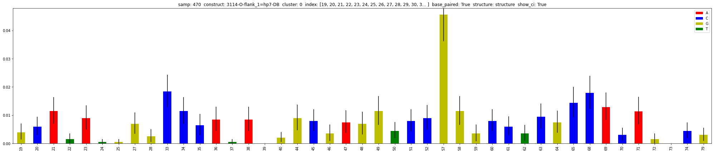
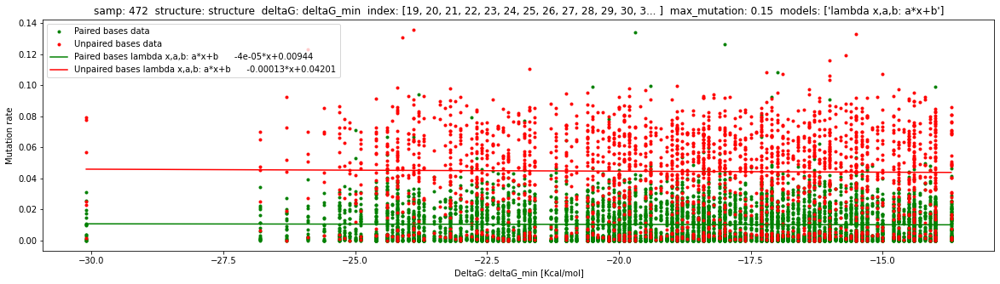

.. _plots:

=====
Plots 
=====

Mutation histogram
==================

.. code-block:: python

    study.plot.mut_histogram(samp=470,
                             construct='3114-O-flank_1=hp7-DB',
                             cluster=0,
                             index=list(range(19,80)),
                             base_paired=True,
                             structure='structure')

.. autofunction:: dreem_nap.plotter.Plotter.mut_histogram

DeltaG along a sample
=====================

.. code-block:: python

    study.plot.deltaG_sample(samp=472, 
                             structure='structure', 
                             deltaG='deltaG_min', 
                             max_mutation=0.15, 
                             models=['lambda x,a,b: a*x+b'], 
                             index=list(range(19,42)))

.. autofunction:: dreem_nap.plotter.Plotter.deltaG_sample

   

