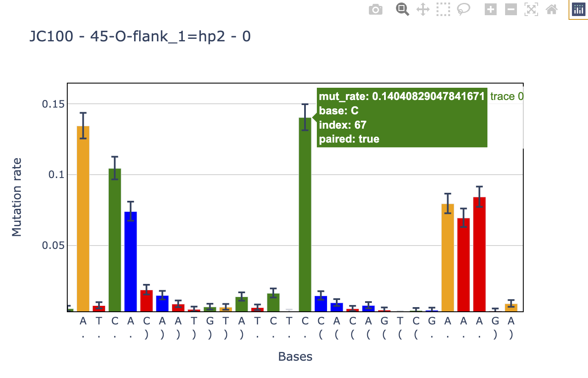
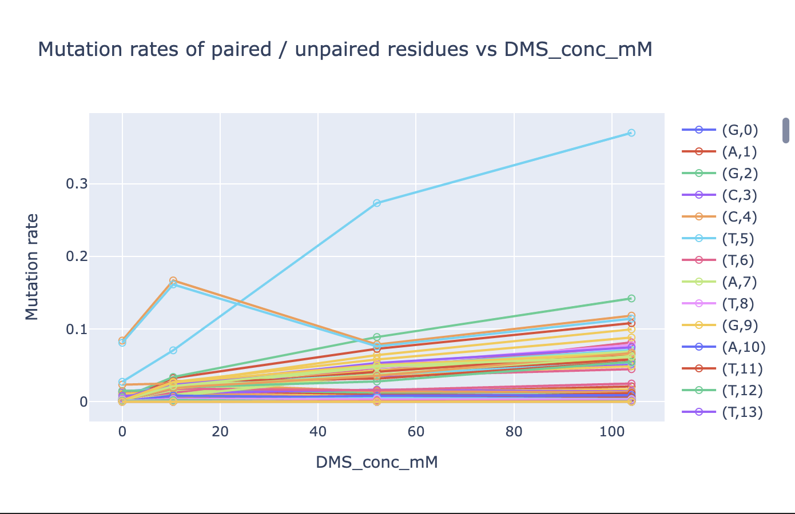
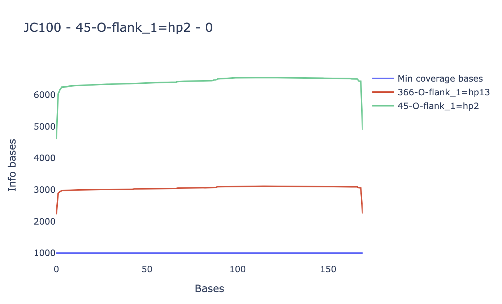

.. _plots:

=====
Plots 
=====

Mutation histogram
==================

.. code-block:: python

    study.mutation_histogram(samp=470,
                             construct='3114-O-flank_1=hp7-DB',
                             cluster=0,
                             index=list(range(19,80)),
                             base_paired=True,
                             structure='structure',
                             savefile='mut_histogram')

.. autofunction:: dreem_nap.study.Study.mutation_histogram
    :noindex:

DeltaG along a single sample for multiple constructs
====================================================

.. image:: img/deltaG_sample.png
    :align: center

.. code-block:: python

    study.deltaG_per_sample(samp=472, 
                        structure='structure', 
                        deltaG='deltaG_min', 
                        max_mutation=0.15, 
                        models=['lambda x,a,b: a*x+b'], 
                        index=list(range(19,42)),
                        savefile='deltaG_sample')

.. autofunction:: dreem_nap.study.Study.deltaG_per_sample
    :noindex:

DeltaG along multiple samples for a single construct
====================================================

.. code-block:: python

    study.deltaG_per_base(construct='3114-O-flank_1=hp7-DB',
                        experimental_variable='DMS_conc_mM', 
                        structure='structure', 
                        max_mutation=0.15, 
                        base_type=['A','C'],
                        models=['lambda x,a,b: a*x+b'], 
                        index=list(range(19,42)),
                        savefile='deltaG_per_base')

.. autofunction:: dreem_nap.study.Study.deltaG_per_base
    :noindex:

   
Base coverage of a row
======================

.. code-block:: python

    study.base_coverage(samp=470
                        construct='3114-O-flank_1=hp7-DB',
                        index='all', 
                        savefile='base_coverage')

.. autofunction:: dreem_nap.study.Study.base_coverage
    :noindex: