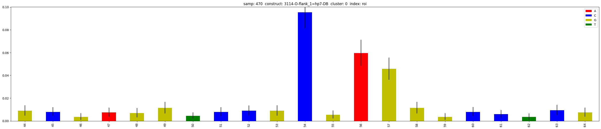
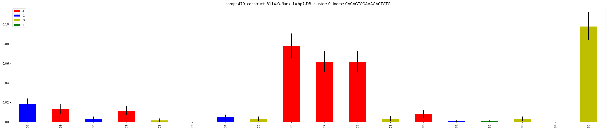
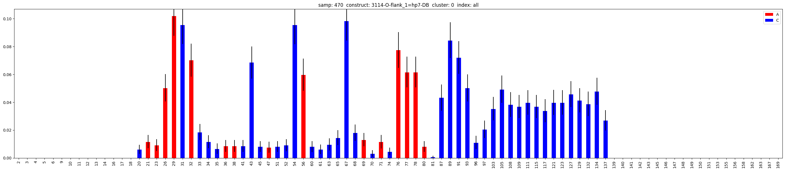

=============
Plotting data
=============

Plotting data requires a study with loaded data. Please check :ref:`loading_data` if you haven't.
We will use the study ``salt`` from the example.

Selective plotting
==================

Let's plot a basic mutation histogram. 

A mutation histogram shows the frequency of mutations of a construct in a sample. 
So we need to indicate the construct and the sample.

If your dataframe has different clusters for each sample-construct combination, you can use the ``cluster`` argument to select a specific cluster.
Default is to use the first cluster (0).

.. code-block:: python

    study.plot.mut_histogram(samp='C6', 
                             construct='9572', 
                             cluster=0)

   
Select only specific indexes
==========================

You can use the ``index`` argument to give a list of 0-indexed positions to plot, here, [19, 20, .., 40, 41].

.. code-block:: python

    study.plot.mut_histogram(samp='C6', 
                             construct='9572', 
                             cluster=0, 
                             index=list(range(19,42)))

.. image:: img/list_index.png
    :align: center

Select only the Region of Interest (ROI)
=====================================

The ROI is defined in the library. 
You can pass ``roi`` to the ``index`` argument to plot the ROI only.

.. code-block:: python

    study.plot.mut_histogram(samp='C6', 
                             construct='9572', 
                             cluster=0, 
                             index='roi')

Select a unique sub-sequence 
=====================================

You can pass a unique sub-sequence to the ``index`` argument to plot it.

.. note::

    The sub-sequence must be present and unique in the construct's sequence.

.. code-block:: python

    study.plot.mut_histogram(samp='C6', 
                             construct='9572', 
                             cluster=0, 
                             index='CACAGTCGAAAGACTGTG')

Select only As and Cs
===================

You can keep only certain types of bases by giving the ``base_type`` argument, here, As and Cs.

.. code-block:: python

    study.plot.mut_histogram(samp='C6', 
                             construct='9572', 
                             cluster=0, 
                             base_type=['A','C'])

   

Select at the same time specific indexes and base types
=======================================================

You can cumulate constrains on the same plotting function. Here, plot only As and Cs in a list of 0-indexed positions to plot, [19, 20, .., 40, 41].

.. code-block:: python

    study.plot.mut_histogram(samp='C6', 
                             construct='9572', 
                             cluster=0, 
                             index=list(range(19,42)), 
                             base_type=['A','C'])

.. image:: img/ac_list_index.png
    :align: center

Select at the same time specific indexes and base types
=======================================================

You can cumulate constrains on the same plotting function. Here, plot only As and Cs in a list of 0-indexed positions to plot, [19, 20, .., 40, 41].

.. code-block:: python

    study.plot.mut_histogram(samp='C6', 
                             construct='9572', 
                             cluster=0, 
                             index=list(range(19,42)), 
                             base_type=['A','C'])

.. image:: img/ac_list_index.png
    :align: center

Select only paired bases based on RNAstructure prediction
=========================================================

You can use the RNAstructure prediction to select only paired or unpaired bases.

``paired`` is a boolean argument, True to select only paired bases, False to select only unpaired bases.

``structure`` is the name of the RNAstructure prediction. 
 - ``structure``: structure prediction of the sequence only
 - ``structure_DMS``: structure prediction of the sequence using the DMS signal
 - ``structure_ROI``: structure prediction of the ROI sub-sequence
 - ``structure_DMS_ROI``: structure prediction of the ROI sub-sequence using the DMS signal

.. code-block:: python

    study.plot.mut_histogram(samp='C6', 
                             construct='9572', 
                             cluster=0, 
                             paired=True,
                             structure='structure')

.. image:: img/ac_list_index.png
    :align: center

