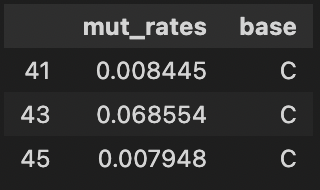
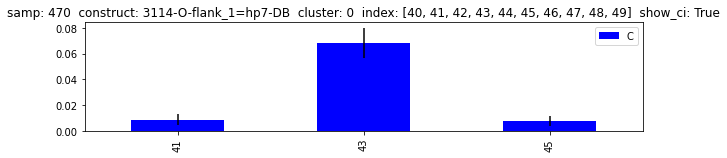
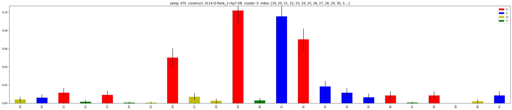
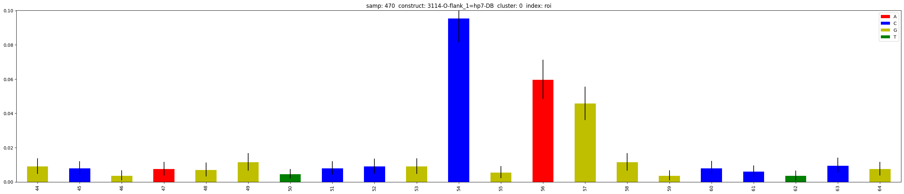
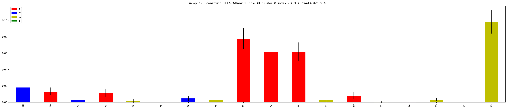
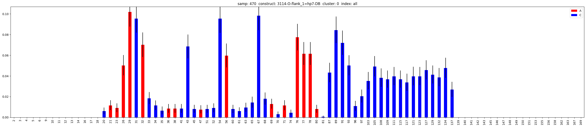
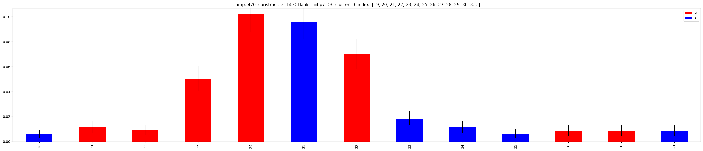
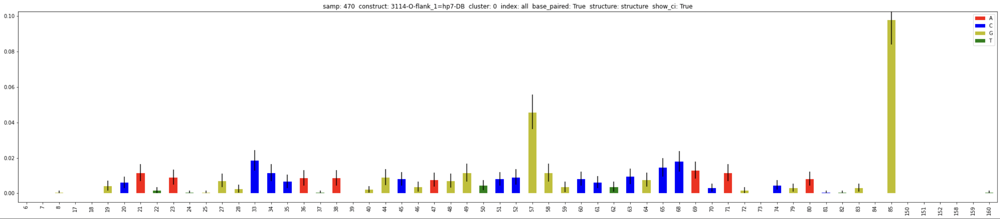

==================
How to select data
==================

This part shows how to select specific bases in a sequence. 
This is typically useful to print selected data to a csv file, or to plot only the data that you need.

**Examples**:

.. code-block:: python

    df = study.mani.get_SCC(samp='C6', construct='9572', cluster=0,    # select sample-construct
                            base_type=['C'], index=list(range(40,50)), # select bases
                            cols=['mut_rates','sequence'])
    df.to_csv('example.csv')
    df.head()

    Save selected data to csv.

.. code-block:: python

    study.plot.mut_histogram(samp='C6', construct='9572', cluster=0,   # select sample-construct
                            base_type=['C'], index=list(range(40,50)), # select bases
                            figsize=(10,2)) 

    
    Plot selected data.

All selection criterias
=======================

The following selection criterias can be applied:

:index (str):
    
    Index to include. Defaults to ``all``. 

    Arguments:

    * ``all``: all bases of the construct.
    * ``roi``: region of interest, i.e of series of 0-indexes such as [``roi_start``, ``roi_start+1``,  ``...``,  ``roi_stop-1``].
    * ``[43,44,45,48]`` (ex): series of 0-indexes.
    * ``ATTACACAGCA`` (ex): a unique sub-sequence of your sequence.

:base_type (list):
    
    Bases types to include.

    Arguments:

    * ``['A','C','G','T']``: all bases (default).
    * Any subset of ``['A','C','G','T']`` (ex:  ``['A','C']``)

:base_paired (bool):
    
    Base pairing to include. 
    
    Arguments:

    * ``None``: (default) paired + unpaired.
    * ``True``: only keep paired bases.
    * ``False``: only keep unpaired bases.

:structure (str):

    Structure from RNAstructure to use for the base-pairing prediction. Only use if argument ``base_paired`` is not ``None``.

    Arguments:
    
    * ``structure``: structure prediction of the sequence only
    * ``structure_DMS``: structure prediction of the sequence using the DMS signal
    * ``structure_ROI``: structure prediction of the ROI sub-sequence
    * ``structure_ROI_DMS``: structure prediction of the ROI sub-sequence using the DMS signal

Select a list of indexes
========================

Let's plot a basic mutation histogram. 
This is a good example of how to use the ``plot`` module with selected data.

A mutation histogram shows the frequency of mutations of a construct in a sample. 
So we need to indicate the construct and the sample.

If your dataframe has different clusters for each sample-construct combination, you can use the ``cluster`` argument to select a specific cluster.
Default is to use the first cluster (0).

You can use the ``index`` argument to give a list of 0-indexed positions to plot, here, [19, 20, .., 40, 41].

.. code-block:: python

    study.plot.mut_histogram(samp='C6', 
                             construct='9572', 
                             cluster=0, 
                             index=list(range(19,42)))

Select the Region of Interest (ROI)
===================================

The ROI is defined in the library. 
You can pass ``roi`` to the ``index`` argument to plot the ROI only.

.. code-block:: python

    study.plot.mut_histogram(samp='C6', 
                             construct='9572', 
                             cluster=0, 
                             index='roi')

Select a unique sub-sequence 
============================

You can pass a unique sub-sequence to the ``index`` argument to plot it.

.. note::

    The sub-sequence must be present and unique in the construct's sequence.

.. code-block:: python

    study.plot.mut_histogram(samp='C6', 
                             construct='9572', 
                             cluster=0, 
                             index='CACAGTCGAAAGACTGTG')

Select by base type
===================

You can keep only certain types of bases by giving the ``base_type`` argument, here, As and Cs.

.. code-block:: python

    study.plot.mut_histogram(samp='C6', 
                             construct='9572', 
                             cluster=0, 
                             base_type=['A','C'])

   

Select at the same time specific indexes and base types
=======================================================

You can cumulate constrains on the same plotting function. Here, plot only As and Cs in a list of 0-indexed positions to plot, [19, 20, .., 40, 41].

.. code-block:: python

    study.plot.mut_histogram(samp='C6', 
                             construct='9572', 
                             cluster=0, 
                             index=list(range(19,42)), 
                             base_type=['A','C'])

Select only paired bases based on RNAstructure prediction
=========================================================

You can use the RNAstructure prediction to select only paired or unpaired bases.

``base_paired`` is True to keep paired bases and False to keep unpaired bases.

``structure`` argument is the RNAstructure prediction you want to use for base-pairing.

.. code-block:: python

    study.plot.mut_histogram(samp='C6', 
                             construct='9572', 
                             cluster=0, 
                             base_paired=True,
                             structure='structure_DMS')

