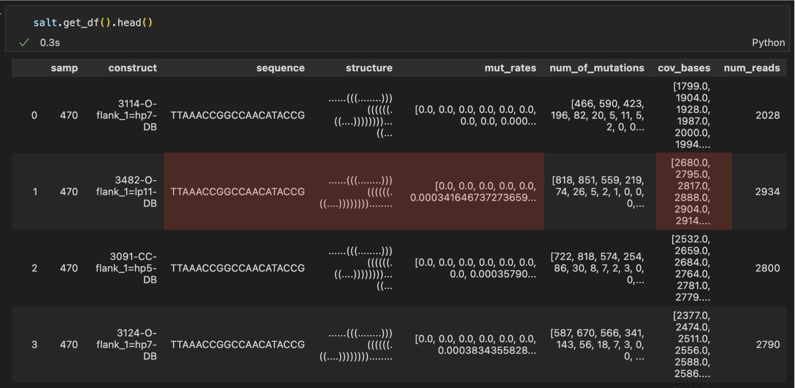
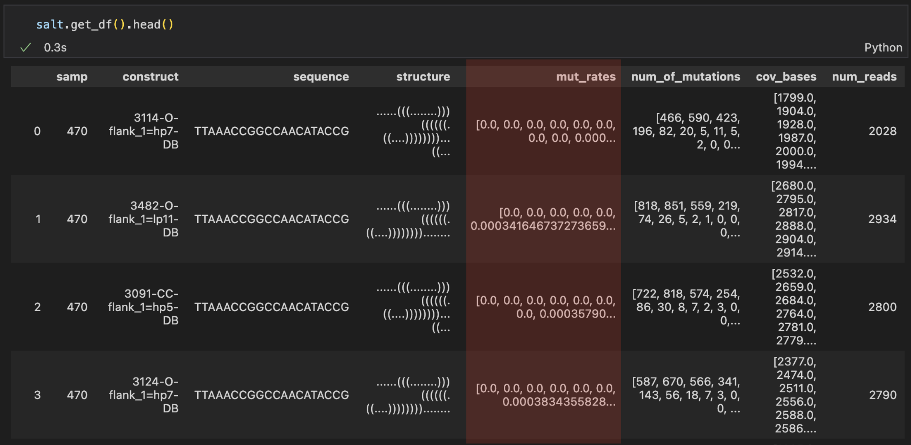
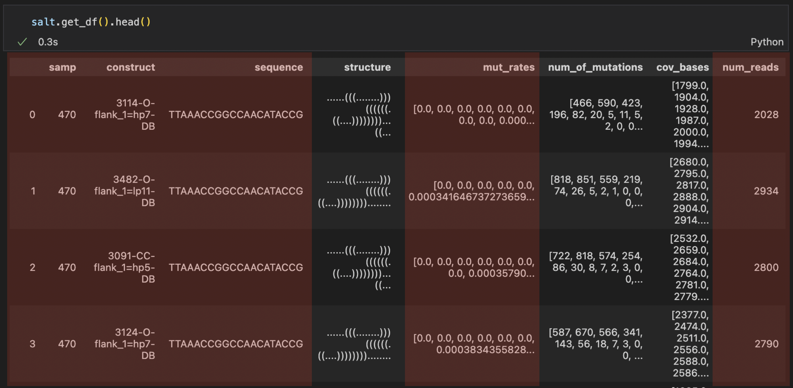

.. _to_csv:

======
To CSV
======

This part will show functions and examples to filter data and download it into csv files.

Save several columns of a single row
====================================

Let's say that you want to download columns of a single row of your dataset, like below, into a csv file.

===== ======================= ======= ============ ========= 
.     mut_rates               base    cov_bases    paired   
===== ======================= ======= ============ ========= 
41    0.008445106805762544    C       1991.0       False    
43    0.06855439642324888     C       1988.0       False    
45    0.007948335817188276    C       1955.0       True     
47    0.007451564828614009    A       1897.0       True     
===== ======================= ======= ============ ========= 

Then run the following code:    

.. code-block:: python

    df = salt.mani.get_SCC(samp='C6',
                           construct='9572', 
                           cols=['mut_rates','sequence','structure','cov_bases'],
                           base_type=['A','C'], 
                           index=list(range(40,50))) 
    df.to_csv('C6_9572.csv')

More about this function:

.. autofunction:: dreem_nap.study.Study.get_df

Save a single column of several rows
====================================

Using a list of indexes
***********************

.. code-block:: python

    df = study.mani.get_col_across_constructs(samp=470, 
                                              col='mut_rates',
                                              index=list(range(40,50))) 
    df.to_csv('470_mut_rates_40_50.csv')

====== ======================= ======================= ======================= ====================== ======================== ======================= ======================= ======================= ======================= ======================= 
.       40                      41                      42                      43                     44                       45                      46                      47                      48                      49                     
====== ======================= ======================= ======================= ====================== ======================== ======================= ======================= ======================= ======================= ======================= 
323    0.001987083954297069    0.008445106805762544    0.003974167908594138    0.06855439642324888    0.00894187779433681      0.007948335817188276    0.003477396920019871    0.007451564828614009    0.006951340615690168    0.011420059582919563   
478    0.009218163195629908    0.016729259132809832    0.0013656538067599864   0.048822123591669514   0.0027313076135199728    0.05769887333560942     0.04848071013997952     0.0013656538067599864   0.006828269033799932    0.006145442130419939   
619    0.0028622540250447226   0.008586762075134168    0.006797853309481216    0.0611587982832618     0.00536480686695279      0.010014306151645207    0.006437768240343348    0.009298998569384835    0.002861230329041488    0.004291845493562232   
834    0.0007651109410864575   0.008416220351951033    0.0007651109410864575   0.06006120887528692    0.14957918898240244      0.010328997704667177    0.061208875286916604    0.011859219586840091    0.020275439938791124    0.0971690895179801     
====== ======================= ======================= ======================= ====================== ======================== ======================= ======================= ======================= ======================= ======================= 

Using a unique sub-sequence 
***************************

.. code-block:: python

    df = study.mani.get_col_across_constructs(samp=470, 
                                              col='mut_rates',
                                              index='CACAGTCGAAAGACTGTG') 
    df.to_csv('470_mut_rates_CACAGTCGAAAGACTGTG.csv')

====== ======================= ======================= ======================= ======================= ======================= ======================== ======================= ======================= ====================== ====================== ====================== ======================= ======================= ======================== ======================== ======================= ======================== ======================== 
.      C                       A                       C                       A                       G                       T                        C                       G                       A                      A                      A                      G                       A                       C                        T                        G                       T                        G                       
====== ======================= ======================= ======================= ======================= ======================= ======================== ======================= ======================= ====================== ====================== ====================== ======================= ======================= ======================== ======================== ======================= ======================== ======================== 
323    0.017857142857142856    0.012896825396825396    0.002974714923153198    0.011403073872087258    0.001487357461576599    0.0                      0.004462072384729797    0.002974714923153198    0.07734258800198314    0.06147744174516609    0.06147744174516609    0.002974714923153198    0.007932573128408527    0.0004957858205255329    0.0004957858205255329    0.002974714923153198    0.0                      0.09766980664352999     
478    0.007167235494880546    0.012286689419795221    0.008870692596383487    0.005800068236096895    0.006480218281036835    0.0020463847203274215    0.048431105047748974    0.0023874488403819918   0.07980900409276943    0.06275579809004093    0.06548431105047749    0.0017053206002728514   0.009549795361527967    0.0020463847203274215    0.0006821282401091405    0.004433833560709414    0.0023874488403819918    0.0017053206002728514   
619    0.006080114449213162    0.009656652360515022    0.010014306151645207    0.016452074391988557    0.003218884120171674    0.000715307582260372     0.010371959942775394    0.002145922746781116    0.07546494992846924    0.056509298998569386   0.06223175965665236    0.00572041473006793     0.010010725777618877    0.005362888809438684     0.0003575259206292456    0.004290311047550947    0.0007150518412584912    0.0003575259206292456   
834    0.004973221117061974    0.009563886763580718    0.0019127773527161439   0.008416220351951033    0.0034429992348890587   0.0                      0.0034429992348890587   0.00306044376434583     0.06809487375669472    0.06847742922723794    0.058530986993114      0.0011476664116296864   0.011476664116296864    0.005355776587605203     0.0                      0.004209720627631076    0.0003827018752391887    0.003444316877152698                                                                                                                                                                                                                                                                                                                                                                                                                                                                   
====== ======================= ======================= ======================= ======================= ======================= ======================== ======================= ======================= ====================== ====================== ====================== ======================= ======================= ======================== ======================== ======================= ======================== ======================== 

.. autofunction:: dreem_nap.manipulator.Manipulator.get_col_across_constructs

Save multiple columns of several rows
=====================================

.. code-block:: python

    salt.columns_to_csv(columns=['samp','construct','sequence','mut_rates','num_reads'],  
                        file='ex.csv', 
                        samples='all')

.. autofunction:: dreem_nap.manipulator.Manipulator.columns_to_csv
